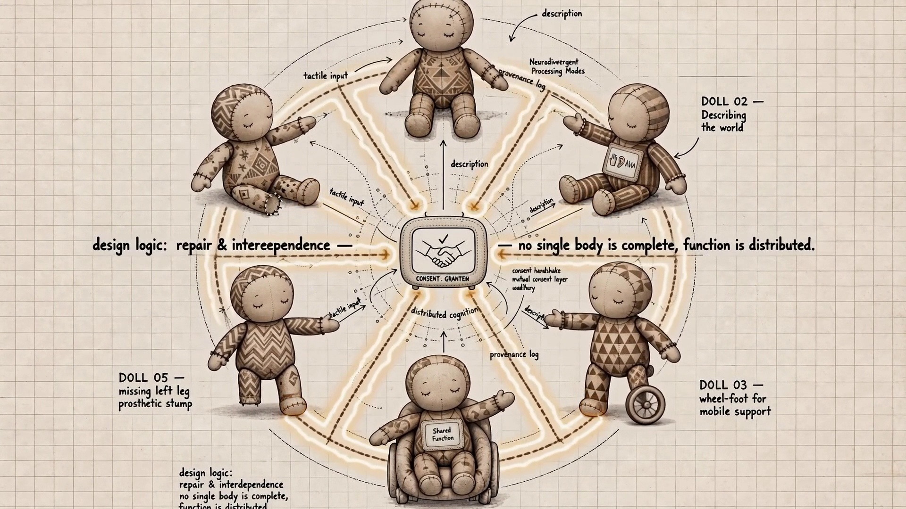
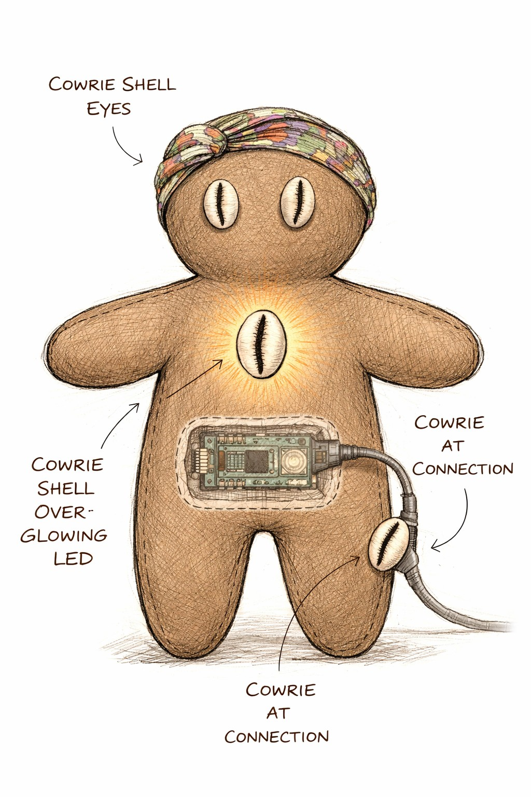

# Ìjóyà

**Soft robotics, tactile feedback, movement, connected bodies, repair, and interdependence.**

> We dance in the garden together because we cannot function alone.

Ìjóyà is one distributed body expressed through multiple incomplete bodies.

Each sculptural body has capacities and absences. No individual body contains every function required to operate independently. Function emerges through relationship: bodies borrow balance, sensing, movement, communication, tension, stability, orientation and support from one another. The resulting collective movement is the dance.

The bodies do not merely symbolize interdependence. Their behavior depends on it. **The relationship is the artwork.**

---

## Status

**In development.** A branch of [Small Systems Lab](https://github.com/ukadike/smallsystemslab).

Everything currently in `assets/` and `studies/` is **concept and maquette study material** — visual development work that establishes body vocabulary, connection logic, access architecture and possible technical systems. None of it documents a fabricated sculpture. Nothing has been built at scale yet.

| Phase | State |
|---|---|
| Conceptual and visual language | Established |
| Accessibility architecture | Established |
| Material and technical direction | Specified, untested |
| Physical prototyping | Not started |
| Scale fabrication | Not started |

## The question

What kinds of systems become possible when dependence is understood as a capacity rather than a weakness?

The work comes from a question that is personal but larger than autobiography. Following a long period of paralysis, I learned movement as cooperation among bodies, technologies, surfaces, care, repetition and time. A brace can perform part of the labor of a muscle. A cane changes the relationship between a body and the ground. A wheelchair redistributes movement through wheels, hands, surfaces, architecture and technology. Another person can temporarily provide balance or orientation.

Function already moves between bodies, objects, environments and systems. Ìjóyà makes that reality sculptural.

**Needing support is not the opposite of functioning. We function because we are connected.**

## What this is not

Ìjóyà is not a collection of cute robots placed outdoors; a demonstration of technological autonomy; a disability simulation; a medicalized work about disability; a story of heroic overcoming; a metaphor where connection exists only in explanatory text; an AI installation; a celebration of independence; a garden decorated with electronic sculptures; or a claim that every body must perform the same functions.

Its subject is distributed capacity.

## Studies

All concept and maquette study material. Nothing here documents a fabricated sculpture.



*Distributed Body Visual Language Study, 2026 — concept study. No single body is complete; function is distributed.*



*Cowrie Tactile Node Study A, 2026 — concept study. Cowrie forms as eyes, illuminated signal, tactile landmark and connection point. Interface, not decoration.*

Full captions, alt text, dates and disclosure: [`docs/work-samples.md`](docs/work-samples.md).

## Repository contents

```
docs/          Canonical project logic, proposal, accessibility, visual language, technical direction
assets/        Concept study images and video
studies/       Working notes and iteration records
CLAUDE.md      Working instructions for Claude Code
```

Start with [`docs/project-logic.md`](docs/project-logic.md). It is the canonical reference; everything else defers to it.

## Documentation

- [Project logic](docs/project-logic.md) — canonical principles, mechanisms, design tests
- [Wave Hill proposal](docs/wave-hill-proposal.md) — the site-responsive installation proposed for Glyndor Terrace Garden
- [Accessibility](docs/accessibility.md) — access as communication architecture, not accommodation
- [Visual language](docs/visual-language.md) — material vocabulary and what to avoid
- [Technical direction](docs/technical-direction.md) — systems, components, and what is deliberately excluded
- [Work samples](docs/work-samples.md) — captions, dates, roles, and disclosure

## Practice lineage

Ìjóyà did not appear from nowhere. During graduate work at NYU ITP the practice already included responsive objects, body-triggered interaction, physical computing and accessible interfaces — *Moving lights* (movement-triggered illumination and wearable experimentation) and the *Multi-modal Thumb Piano* (an accessible browser-based musical interface). That inquiry continued through accessibility work at Lincoln Center, teaching and mentoring with the Processing Foundation, and artist and technology work at Eyebeam.

Ìjóyà extends that trajectory from responsive objects toward a distributed sculptural ecology in which bodies borrow function from one another.

## Related

- [Small Systems Lab](https://github.com/ukadike/smallsystemslab) — the umbrella practice
- Earth Sensors Lab — accessible environmental observation; provides the site-study methodology used here. A distinct project.

## Author

Adekemi "Kemi" Sijuwade-Ukadike — [github.com/ukadike](https://github.com/ukadike)

## License

Documentation and text: CC BY-NC-SA 4.0. Any software added later: MIT.
