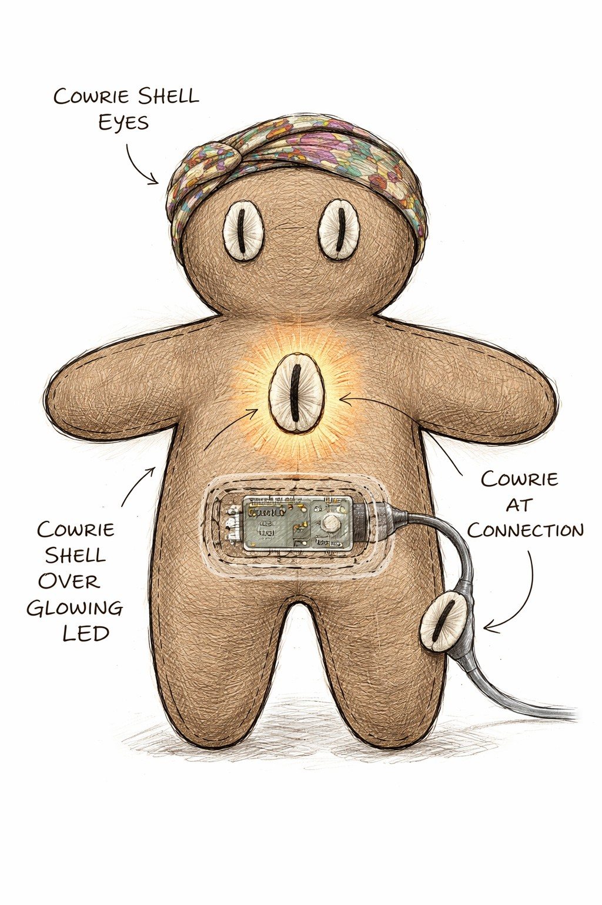
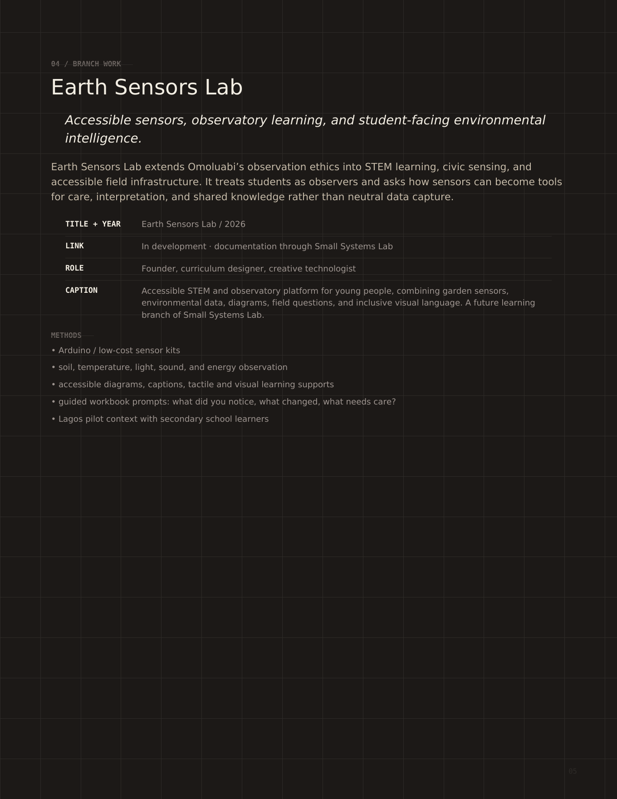
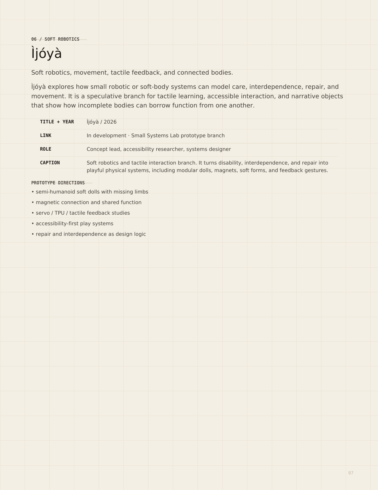

# Work samples

All material listed here is **concept and maquette study material**. None of it documents a fabricated sculpture. Captions must preserve that distinction wherever this material is presented.

## Disclosure

Some studies use AI-assisted visual development, artist-directed. Where that applies it is stated in the caption. Concept, writing and system architecture are the artist's own.

---

## 01 — Distributed Body Visual Language Study

`assets/images/01-distributed-body-visual-language.jpg`

**2026 · Concept study, digital drawing (AI-assisted visual development, artist-directed) · Dimensions variable**

Visual-language study for *Ìjóyà: Borrowed Function in the Garden*. Stitched textile bodies with differing capacities and absences — one missing a leg, one with a wheel-foot, one seated — arranged around a shared connection point. Annotations map how tactile input, description and support travel between bodies. Establishes the core principle: no single body is complete; function is distributed.

*Alt text:* Annotated diagram of five stitched textile figures arranged in a circle around a central connection point, drawn in earth tones on grid paper. Each figure has a different body — one missing a leg, one with a wheel in place of a foot, one seated. Labeled lines connect the figures, marking tactile input, description and shared function passing between them.

---

## 02 — Cowrie Tactile Node Study A

`assets/images/02-cowrie-tactile-node-a.png`

**2026 · Concept study, digital drawing (AI-assisted visual development, artist-directed) · Dimensions variable**

Construction study for the cowrie interface node. Cowrie forms operate as functional and cultural interface elements — eyes, illuminated chest signal, tactile landmark, and connection point between bodies — with embedded low-voltage electronics visible beneath the textile skin. Cowries are interface, not decoration.

*Alt text:* Drawing of a soft stitched textile figure in warm brown, with cowrie shells for eyes and a glowing cowrie at the chest. A panel in the torso is opened to show a small circuit board beneath the fabric. A cable runs from the hip to another cowrie at a connection point. Handwritten labels identify each cowrie's function.

---

## 03 — Cowrie Tactile Node Study B

`assets/images/03-cowrie-tactile-node-b.png`

**2026 · Concept study, digital drawing (AI-assisted visual development, artist-directed) · Dimensions variable**

Second construction study extending the same interface language and soft-body direction, testing variation in seam, surface and connection detail across differing bodies.

*Alt text:* Second construction drawing of a soft stitched figure using the same cowrie interface vocabulary, with variations in seam placement, surface pattern and connection detail.

---

## 04 — Earth Sensors Lab

`assets/images/04-earth-sensors-lab.png`

**2026 · Ongoing project documentation · Small Systems Lab**

Accessible environmental-observation and STEAM platform combining low-cost garden sensors, field questions, and tactile and visual learning supports. Provides the site-observation methodology proposed for the Winter Workspace — studying wind, light, moisture, temperature, plant movement and accessible routes.

**A distinct project from Ìjóyà.** Included as practice context; it establishes methodology, not sculptural direction.

*Alt text:* Project documentation page for Earth Sensors Lab on a dark background, listing the project title, role, caption and methods, including low-cost sensor kits, soil and temperature observation, accessible diagrams and guided field prompts.

---

## 05 — Soft Robotics Direction

`assets/images/05-soft-robotics-direction.png`

**2026 · Project documentation · Small Systems Lab**

Overview of the Ìjóyà branch: soft robotics, tactile feedback, movement and connected bodies. Documents prototype directions including semi-humanoid soft forms with missing limbs, magnetic connection and shared function, servo and tactile-feedback studies, and repair and interdependence as design logic.

*Alt text:* Project documentation page for Ìjóyà on a cream background, listing title, role, caption and prototype directions including soft dolls with missing limbs, magnetic connection, tactile feedback studies and interdependence as design logic.

---

## 06 — Distributed Body Study (animated)

[Download / view the video](../assets/video/06-distributed-body-animated.mp4) (15s, 14 MB)

`assets/video/06-distributed-body-animated.mp4`

**2026 · Video, 15 seconds · Concept study, digital animation (AI-assisted visual development, artist-directed)**
1920×1080 · H.264 · 24 fps · audio track present

Animated study of the distributed body. Signal moves between five incomplete bodies — tactile input, description and shared function traveling across the group rather than originating in any single form. Extends study 01 into time, showing propagation as the mechanism of the dance.

*Description:* The annotated circle of five stitched figures from study 01, animated. Light travels along the connecting lines between the figures, moving outward from the central connection point and passing from body to body, so that a signal arriving at one figure continues on to the next rather than stopping.

---

## Excluded material

Kept out of presentation deliberately. Recorded here so it does not get reintroduced.

| Material | Reason |
|---|---|
| Toy-robot interdependence study | Wooden toy robots holding hands. Directly contradicts the stated visual language — reads as cute autonomous robots, the exact framing the project rejects. |
| "Continuance Garden" image and video | A different Small Systems Lab concept. Not Ìjóyà. Does not show the bodies, and the sci-fi kiosk aesthetic conflicts with the material vocabulary. |
| Physical prototype contact sheet | Mislabeled. Contains Omoluabi and SSL system slides, not Ìjóyà prototypes, and no physical prototype exists. |

## Gaps

The strongest missing sample is a study showing **human-scale bodies in garden context** in the material vocabulary described in `docs/visual-language.md`. Current material shows only small-scale bodies against neutral backgrounds.
